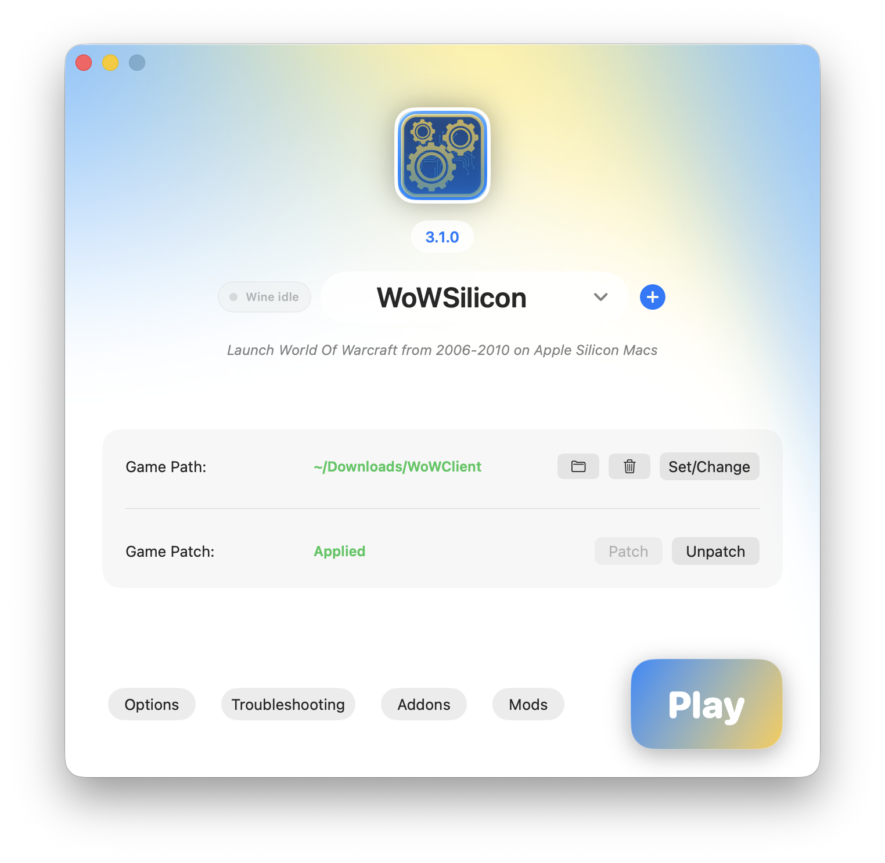

<p align="center">
  
</p>

<h1 align="center">WoWSilicon</h1>

<p align="center">
  <a href="https://github.com/WoWSilicon/WoWSilicon/actions/workflows/release.yml">
    
  </a>
  <a href="https://github.com/WoWSilicon/WoWSilicon/stargazers">
    
  </a>
  <a href="https://github.com/WoWSilicon/WoWSilicon/releases">
    
  </a>
  <a href="https://github.com/WoWSilicon/WoWSilicon/releases">
    
  </a>
</p>

WoWSilicon is a macOS launcher for older World of Warcraft clients on Apple Silicon Macs.

It is built around CrossOver, RosettaX87, DX9 translation, and runtime patching so clients from the 2006-2010 era can run more efficiently on modern macOS hardware.

<p align="center">
  
</p>

## Supported Clients

- Vanilla 1.12.1
- The Burning Crusade 2.4.3
- Wrath of the Lich King 3.3.5a
- Custom profiles based on the supported client families

## Features

- Version profiles for separate client folders
- CrossOver patching for the RosettaX87 launch path
- Game-folder patching for required runtime files
- libSiliconPatch mod (reducing x87-heavy runtime paths)
- Addon manager with Git URL installs, updates, bulk import, and bulk export
- Mod manager for DLL-style mods
- Realmlist editor
- Graphics options, Retina mode, cursor scaling, Option-as-Alt, environment variables, and Metal HUD support
- Built-in update checks through the macOS app menu and Options window

## Requirements

- Apple Silicon Mac
- macOS 15 or newer
- CrossOver 26 installed and opened at least once
- A legally acquired local World of Warcraft client folder
- Permission to modify the selected game folder and CrossOver app bundle

## Installation

Download the latest release from:

https://wowsilicon.github.io/

Move `WoWSilicon.app` to `/Applications`.

If macOS blocks the app because the build is unsigned, remove the quarantine attribute after moving it:

```sh
xattr -cr /Applications/WoWSilicon.app
```

Then open WoWSilicon, select the game folder and CrossOver app path, apply the required patches, and launch the selected client profile.

## Development

Build and test:

```sh
swift build
swift test
```

Build the app bundle:

```sh
make bundle
```

Build a DMG:

```sh
make dmg
```

Run the bundled app:

```sh
make run
```

## Releases

Release automation is handled through GitHub Actions. A version tag such as `v2.6.0` builds the DMG, creates or updates the GitHub Release, generates the signed update feed, and publishes `appcast.xml` to the Pages repository.

See [docs/releasing.md](docs/releasing.md) for the release flow and required repository secrets.

## Disclaimer

WoWSilicon is not affiliated with or endorsed by Blizzard Entertainment.

This project is not advocating the use of any private server. It is intended to help older client binaries run on Apple Silicon hardware in an efficient and performant way. The project maintainers are not liable for how the launcher is used.
